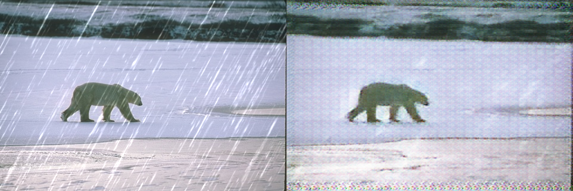
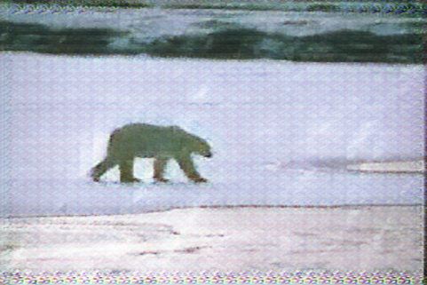
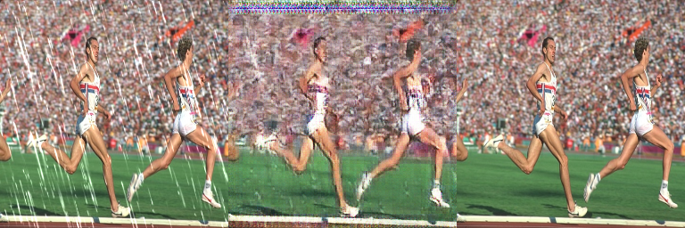

# IMAGE-DERAINING

Single-image deraining project built with PyTorch using the Rain100L dataset. This repository trains a reconstruction model and a Pix2Pix-style GAN to remove rain streaks from rainy images, then evaluates the trained generator on the test set and runs inference on custom images.

## Project Overview

- Dataset: Rain100L
- Framework: PyTorch
- Models:
  - U-Net-style autoencoder
  - Pix2Pix generator and discriminator
- Tasks supported:
  - training
  - resumed training from saved GAN checkpoints
  - test-set evaluation with PSNR and SSIM
  - single-image deraining demo

## Repository Structure

```text
IMAGE-DERAINING/
|-- app.py
|-- train.py
|-- test.py
|-- requirements.txt
|-- dataset/
|   |-- rain100l_loader.py
|-- models/
|   |-- unet_autoencoder.py
|   |-- pix2pix_gan.py
|-- outputs/                # generated locally, not tracked
|-- Rain100L/               # dataset locally, not tracked
```

## Features

- Correct rainy/clean image pairing based on Rain100L image IDs
- GPU training and inference with CUDA
- Mixed precision training when CUDA is available
- Resume support for GAN training from saved checkpoints
- Test pipeline that saves derained images and comparison outputs
- Simple CLI app for deraining one custom image

## Setup

Create and use a virtual environment:

```powershell
python -m venv .venv
.venv\Scripts\Activate.ps1
```

Install dependencies:

```powershell
pip install -r requirements.txt
pip install torch torchvision --extra-index-url https://download.pytorch.org/whl/cu128
```

## Dataset

Place the Rain100L dataset in the project root so the code can find:

```text
Rain100L/
|-- rain_data_train_Light/
|   |-- rain/
|   |-- norain/
|-- rain_data_test_Light/
|   |-- rain/X2/
|   |-- norain/
```

The dataset itself is not included in this repository.

## Training

Train both stages:

```powershell
.venv\Scripts\python.exe train.py --batch-size 8 --epochs-autoencoder 10 --epochs-gan 10 --num-workers 2
```

Continue GAN training from existing checkpoints:

```powershell
.venv\Scripts\python.exe train.py --skip-autoencoder --resume-generator outputs\pix2pix_generator.pth --resume-discriminator outputs\pix2pix_discriminator.pth --epochs-gan 20 --batch-size 8 --num-workers 2
```

Saved checkpoints:

- `outputs/autoencoder.pth`
- `outputs/pix2pix_generator.pth`
- `outputs/pix2pix_discriminator.pth`

## Testing

Run evaluation on the Rain100L test split:

```powershell
.venv\Scripts\python.exe test.py --num-workers 2
```

This generates:

- `outputs/test_results/derained/`
- `outputs/test_results/comparisons/`
- `outputs/test_results/metrics.txt`

Latest recorded metrics from the local run:

- `Average PSNR: 22.5720`
- `Average SSIM: 0.6804`

## Sample Results

Single-image demo result:



Generated derained output:



Test-set comparison example:



## Demo App

Run deraining on a single image:

```powershell
.venv\Scripts\python.exe app.py path\to\your\rainy_image.png
```

Example:

```powershell
.venv\Scripts\python.exe app.py Rain100L\rain_data_test_Light\rain\X2\norain-1x2.png
```

Optional output paths:

```powershell
.venv\Scripts\python.exe app.py Rain100L\rain_data_test_Light\rain\X2\norain-1x2.png --output outputs\my_result.png --comparison outputs\my_compare.png
```

## Notes

- The current inference pipeline uses the trained Pix2Pix generator.
- The autoencoder is trained separately and is not directly used in `app.py` or `test.py`.
- `outputs/`, `.venv/`, and `Rain100L/` are intentionally excluded from Git tracking.

## Future Improvements

- Add optimizer checkpoint resume
- Add per-epoch validation logging
- Save best model instead of only final model
- Add a true U-Net with skip connections
- Integrate the autoencoder and GAN more tightly into a real hybrid pipeline
